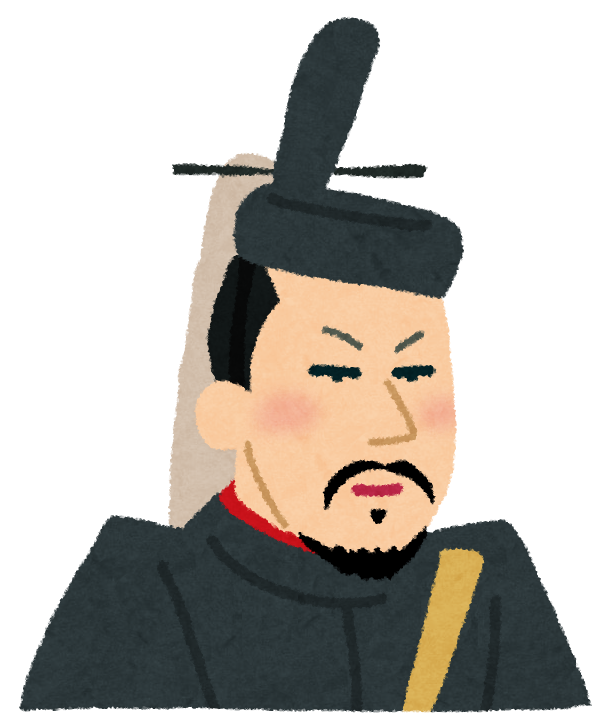

# 鎌倉時代の概要
  源頼朝が平氏政権を倒し、鎌倉幕府を開いてから倒幕するまでの約150年間の武家政権の時代である。
  　ここでは、鎌倉時代の主な出来事をVRやアトラクションで楽しむことができる。

# アトラクション紹介
  [・元寇による戦闘体験(vsモンゴル軍)](https://takajo-soft13.github.io/Kamakura/Genkou)
  
  [・鎌倉時代の産業体験](https://takajo-soft13.github.io/Kamakura/sangyou)
  
  [・承久の乱！島流しアトラクション(vsモンゴル軍)](https://takajo-soft13.github.io/Kamakura/joukyuu)
